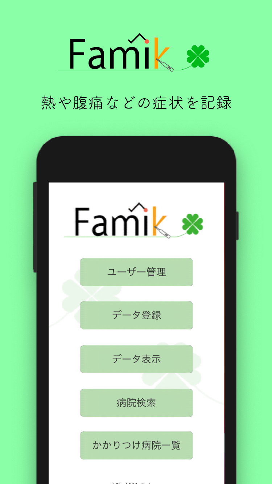
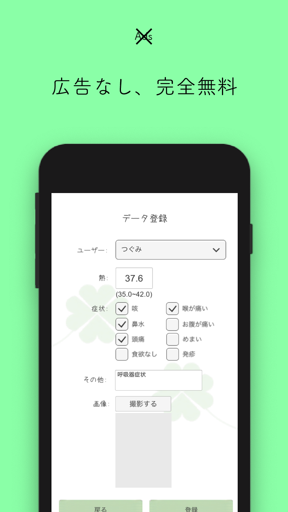

    
    <table>
        <tr>
            <td></td>
            <td></td>
            <td></td>
            <td></td>
            <td></td>
        </tr>
    </table>

---

**Famik** は、Unity で制作されたスマートフォン向け病状管理アプリケーションです。

2019年3月に開発が開始され、2019年9月に開催された[「Tech Kids Grand Prix 2019」](https://techkidsschool.jp/grandprix/2019/)に応募した時点でバージョン beta 1.0.0 が割り当てられました。

その後、2020年3月に Google Play Store にてバージョン 1.0.0 が公開され（現在は非公開）、最終的にバージョン 1.3.0 まで開発が行われました。

## 機能
- 複数ユーザー管理
- 体温以外に症状を記録可能
- 体温の音声入力
- 現在位置から病院を検索
- ワードを指定して病院を検索
- 病院のショートカット登録（「かかりつけ病院」機能）
- データのスクリーンショット共有機能
- よつばちゃんの声かけ機能

## 実績
- [Tech Kids Grand Prix 2019](https://techkidsschool.jp/grandprix/2019/) <b>グランプリ</b>
- [アプリ甲子園2019](https://note.com/appko/n/n7ac49e873b18) <b>ファイナリスト</b>

## ライセンス
このプロジェクトは Apache License 2.0 でオープンソースとして提供されています。

GitHub へのアップロードにあたり、一部の有償アセットや再配布禁止アセットを除外しています。
- /Assets/CP/ProChart
- /Assets/CP/ProChartDemo
- /Assets/Fonts/azuki.ttf
- /Assets/Simple Health Bar
- /Assets/UI/TableLayout
- /Assets/Developing
- /Assets/Plugins/gdiplus.dll
- /Assets/Plugins/System.Drawing.dll

このプロジェクトに含まれる以下のライブラリは、各ライブラリのライセンスに従います。
ライセンスについては、各サイトを参照してください。
- steelejay/LowkeySpeech
- anchan828/social-connector
- さわらびゴシック

---

    

